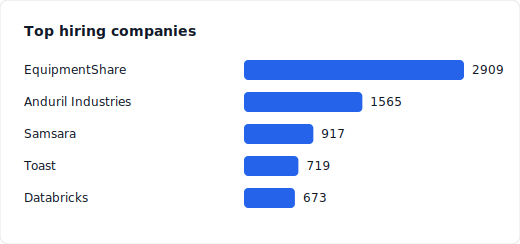
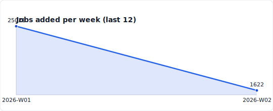
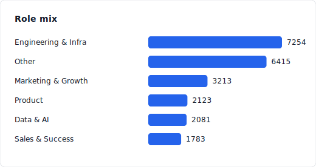
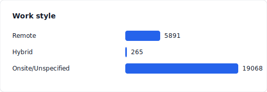
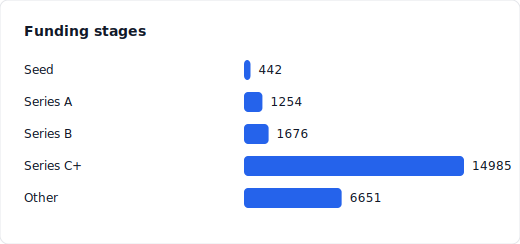

# Startup jobs dataset

<!-- DATASET_STATS:START -->

## Dataset quick stats

Total unique jobs: 24832
Most recent update: 2025-12-31T20:22:52.060Z (0 days ago)

Files:
- out/index.json (deduped index)
- out/jobs.jsonl (append-only log)
- out/jobs.csv (spreadsheet-friendly)

<!-- DATASET_STATS:END -->

## Quick start

```bash
git clone https://github.com/themikemoniker/startup-job-board-scrape.git
cd startup-job-board-scrape
npm ci   # install Node 22-compatible deps
```

The scraper saves outputs to `out/index.json`, `out/jobs.jsonl`, and `out/jobs.csv`. Keep those files under version control so readers always have the latest dataset.

## Scrape vs. fetch commands

- `npm run scrape` runs `scrape.js` directly. Use it when you want full control over flags (`node scrape.js --mode=today --startPage=3`).
- `npm run fetch:*` commands are shortcuts that call `scrape.js` with presets:
  - `fetch:today` → mode `today`, short run, great for daily updates.
  - `fetch:all` → mode `all`, backfills 180 days.
  - `fetch:all:365` → mode `all`, backfills 365 days.

Think of `fetch` as “opinionated presets” and `scrape` as “manual mode.”

## Which command should I use?

- New repo or major parser change → `npm run fetch:all` (or `fetch:all:365`). It walks historic pages and rebuilds the dataset from scratch, so expect a long run.
- Daily refresh → `npm run fetch:today`. It only grabs the newest listings, runs faster, and produces small diffs.
- After any run, check `git status`, review the `out/` changes, and commit data + code together.

## Testing and debugging

- Quick parser check: `npm run test:fetch` (runs `scripts/test-fetch.js`). It downloads a sample page and asserts that the selectors still work.
- Manual probing: `node scripts/test-scrape.js --url=<job-url>` to inspect one listing end-to-end.
- Docs update: `npm run readme` regenerates the stats block at the top of this file after a successful scrape.

## GitHub Actions automation

- `scrape.yml` (`scrape-topstartups`) runs every 4 hours. It installs deps, runs `npm run fetch:today`, refreshes the README stats, and commits any dataset changes.
- `fetch-all.yml` is manual-only; dispatch it when you need a fresh 180-day backfill (`npm run fetch:all`).

Each workflow uses the GitHub Actions bot identity to push changes. Visit the Actions tab to monitor runs or re-run failures.

## Jobseeker insights

<!-- DATASET_INSIGHTS:START -->

### Top hiring companies

EquipmentShare currently leads with 2731 live roles.

### Weekly job trend

Showing the last 1 weeks of postings.

### Role mix

Engineering & Infra roles make up 29% of all listings.

### Work style

23% remote-friendly, 1% hybrid, 76% onsite/unspecified.

### Funding stages

Seed startups lead postings right now.

<!-- DATASET_INSIGHTS:END -->
